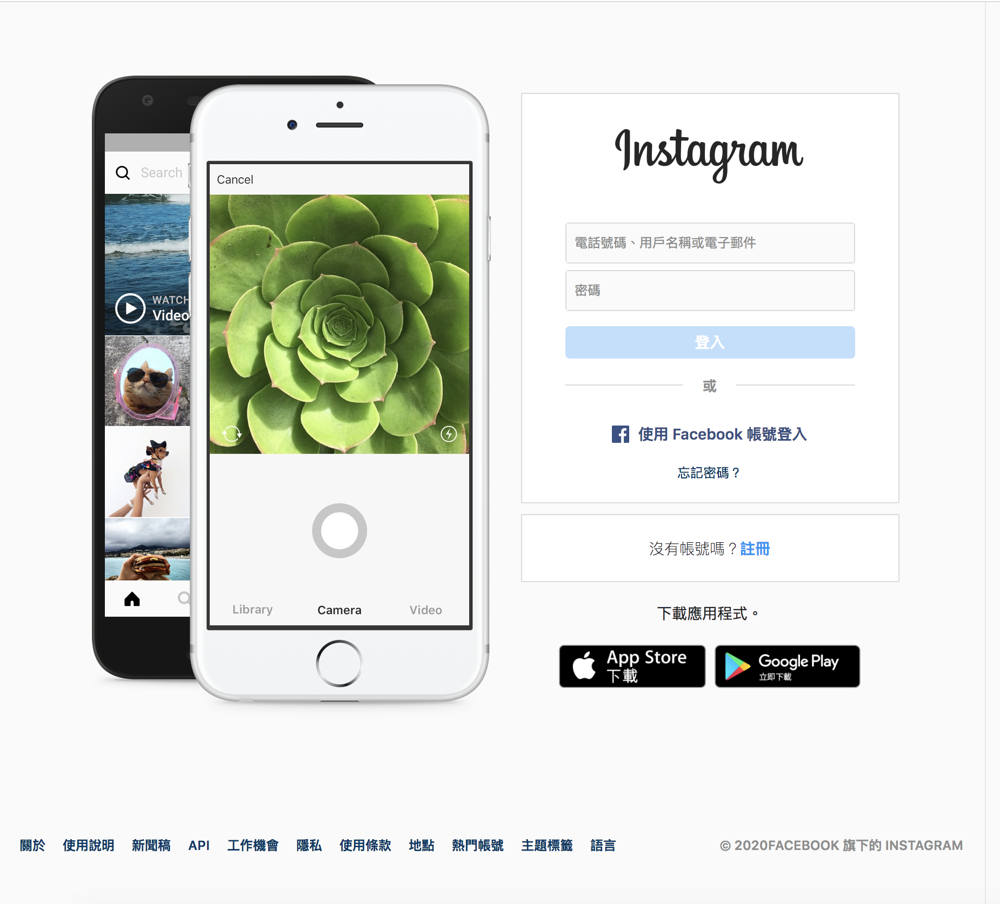
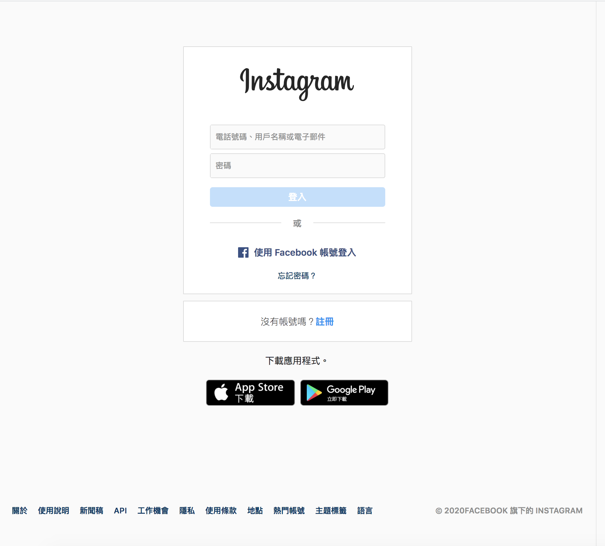
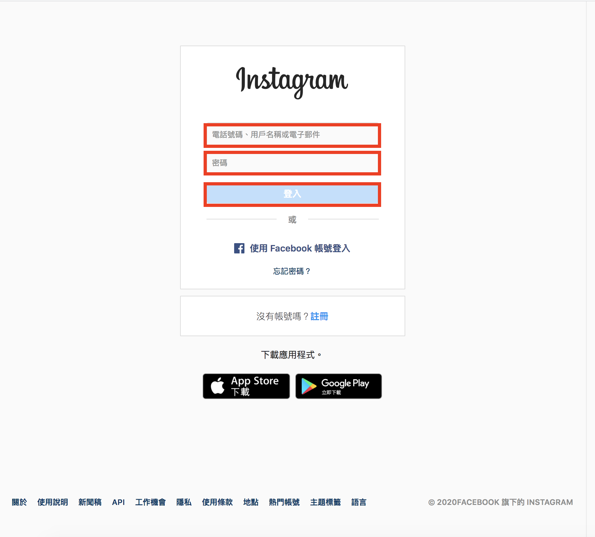
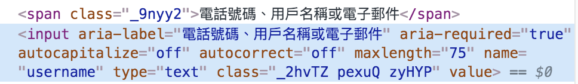
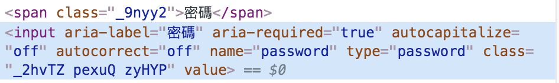
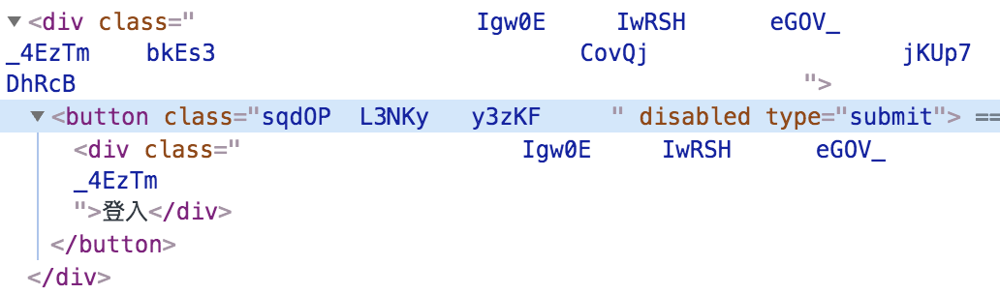
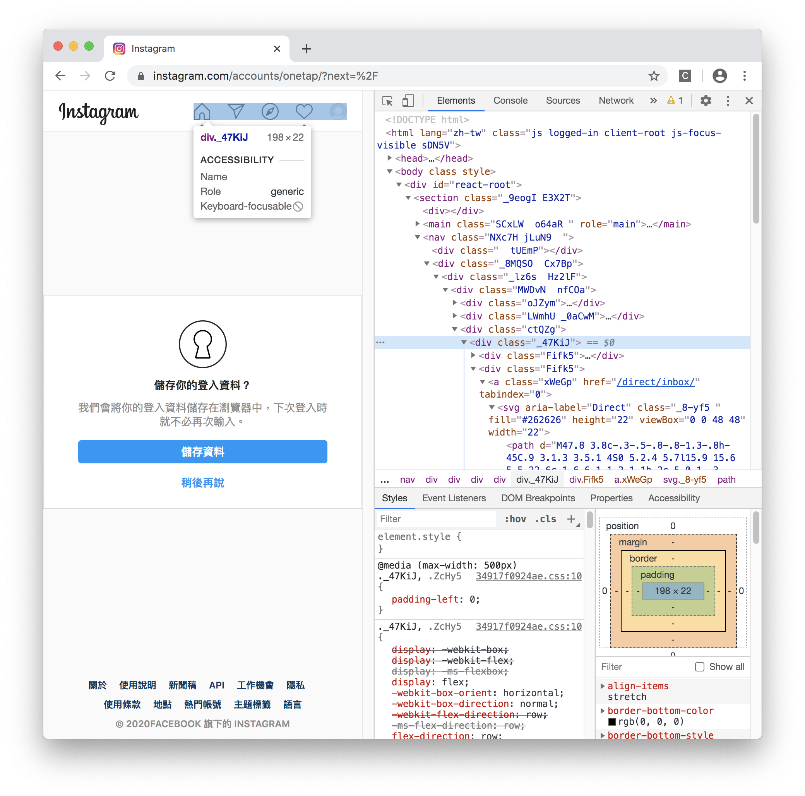
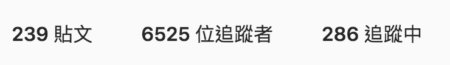
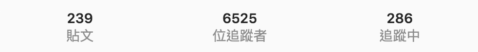

#### [回目錄](../README.md)
### Day9 依樣畫葫蘆，完成Instagram登入並取得追蹤人數


有了Facebook爬蟲的經驗後，其實我覺得這篇大家應該是有能力獨自完成的  
建議大家先嘗試看看能否登入Instagram並抓出粉專追蹤人數  
這篇文章建議是實作遇到問題或是你完成後過來印證我們的思路是否相同

----
以下是我撰寫程式的思路
1. 確認IG登入的方式及需要的參數
2. 登入後有什麼元件可以用來辨別已登入
3. IG追蹤人數的元件位置

你只需要根據上面的步驟一步一步的解決，就能成功的完成今天的目標，接下來我會說明你執行上可能會遇到的問題及解決方式  
1. **確認IG登入的方式及需要的參數**
原本我用Xpath都可以正常登入Instagram，但後來我發現他登入的畫面偶爾會長不一樣(如下圖)導致Xpath路徑錯誤  

  
所以這裡我們要用不一樣的方式來抓取紅框內元件  
  

進入開發者模式後我們會發現在填寫 **電話號碼、用戶名稱或電子郵件** 以及 **密碼** 輸入的地方(input元件)他們用 **name** 這個attribute  
  
  

而登入的按鈕(button元件)則是使用 **type** 這個attribute
  

根據上面的分析後我們就可以改用css的方式來抓取IG登入的元素，並操作它
```js
//填入ig登入資訊
let ig_username_ele = await driver.wait(until.elementLocated(By.css("input[name='username']")));
ig_username_ele.sendKeys(ig_username)
let ig_password_ele = await driver.wait(until.elementLocated(By.css("input[name='password']")));
ig_password_ele.sendKeys(ig_userpass)

//抓到登入按鈕然後點擊
const login_elem = await driver.wait(until.elementLocated(By.css("button[type='submit']")))
login_elem.click()
```
2. **登入後有什麼元件可以用來辨別已登入**
這裡我一樣是選擇右上角的頭像區塊作為識別登入與否  
  

```js
//登入後才會有右上角的頭像的區塊，我們以這個來判斷是否登入
await driver.wait(until.elementLocated(By.xpath(`//*[@id="react-root"]//*[contains(@class,"_47KiJ")]`)))
```
3. **IG追蹤人數的元件位置**
如果你跟我一樣充滿實驗精神，你會發現IG粉專的頁面會隨著螢幕寬度更改而更改Xpath的路徑  
寬螢幕的Xpath  
  
```
//*[@id="react-root"]/section/main/div/header/section/ul/li[2]/a/span
```
窄螢幕的Xpath  
  
```
//*[@id="react-root"]/section/main/div/ul/li[2]/a/span
```
為了避免因為螢幕寬度不一樣造成Xpath不同，所以我們要在一開始打開瀏覽器的時候設定他的視窗大小(本專案以寬螢幕作為範例)，所以請在打開瀏覽器的下方加上視窗大小的設定  

```js
var driver = new webdriver.Builder().forBrowser("chrome").withCapabilities(options).build();// 建立這個broswer的類型
//考慮到ig在不同螢幕寬度時的Xpath不一樣，所以我們要在這裡設定統一的視窗大小
driver.manage().window().setRect({ width: 1280, height: 800, x: 0, y: 0 });
```
接下來就是很單純的抓出追蹤人數的元件並輸出
```js
//登入成功後要前往粉專頁面
const ig_fans_web = "https://www.instagram.com/baobaonevertell/" // 筆者是寶寶不說的狂熱愛好者
await driver.get(ig_fans_web)

let ig_trace = 0;//這是紀錄IG追蹤人數
const ig_trace_xpath = `//*[@id="react-root"]/section/main/div/header/section/ul/li[2]/a/span`
const ig_trace_ele = await driver.wait(until.elementLocated(By.xpath(ig_trace_xpath)), 5000)//我們採取5秒內如果抓不到該元件就跳出的條件    
// ig因為當人數破萬時文字不會顯示，所以改抓title
ig_trace = await ig_trace_ele.getAttribute('title')
console.log(`追蹤人數：${ig_trace}`)
driver.quit();
```

到目前為止我們已經可以抓出 FB & IG 粉專的追蹤人數了，充滿好奇心的讀者可以先試著看看利用爬蟲爬完FB粉專完後繼續爬IG  

上面這的程式碼可以在[這裡](https://github.com/dean9703111/ithelp_30days/day9)找到喔
你可以整個專案clone下來  
```
git clone https://github.com/dean9703111/ithelp_30days.git
```
如果你已經clone過了，那你每天pull就能取得更新的資料嚕  
```
git pull origin master
cd day9
yarn
yarn start
```
### [Day10 小孩子才選擇，我要一隻程式爬完FB & IG粉專](../day10/README.md)