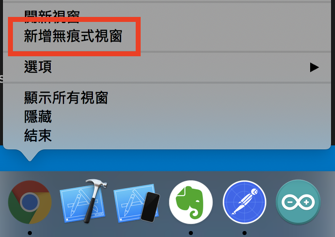
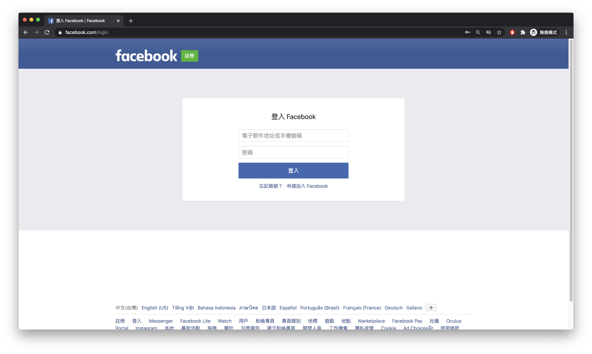
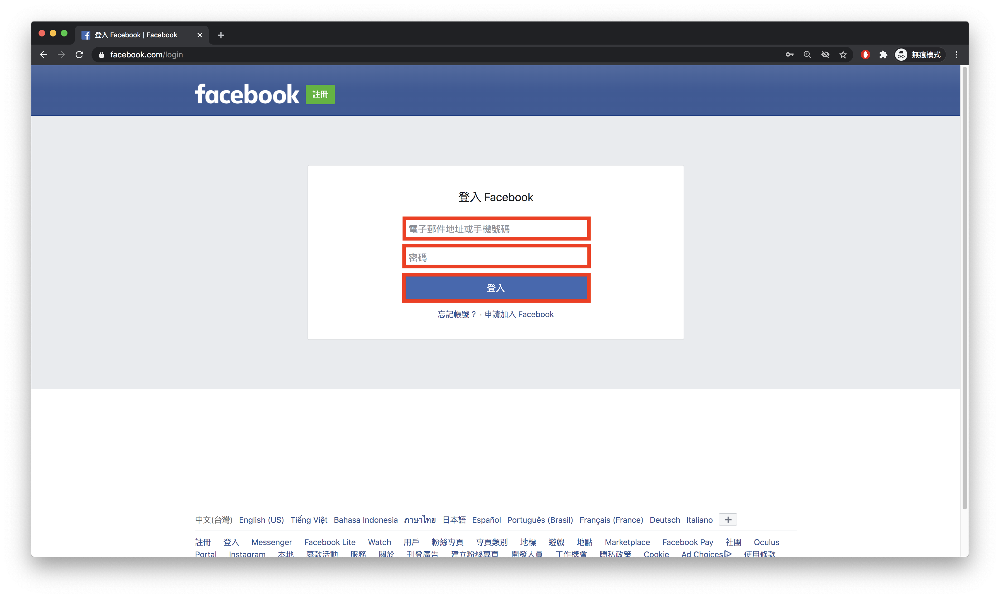
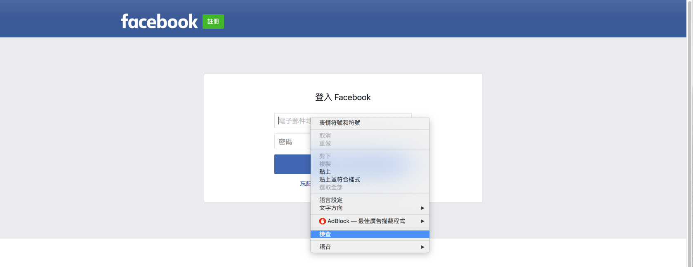
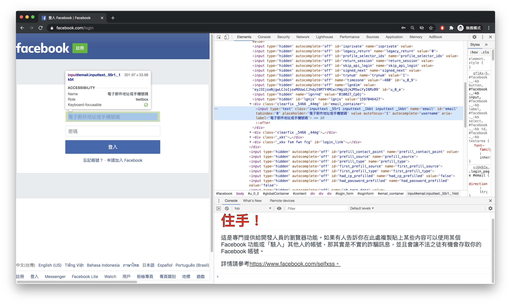
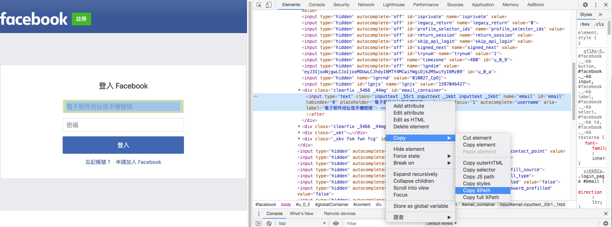
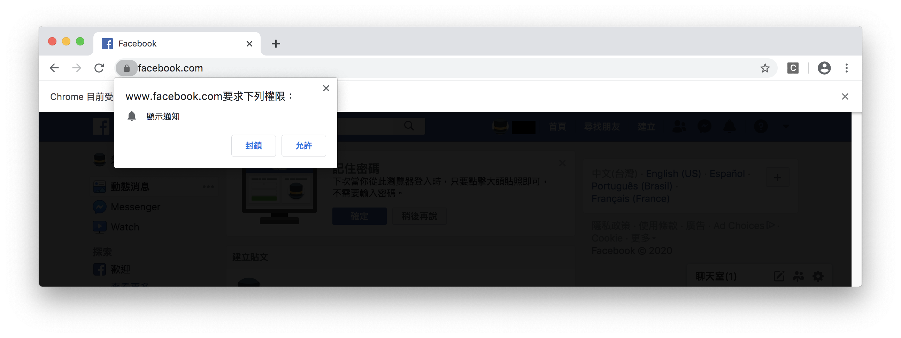

#### [回目錄](../README.md)
## Day9 分析Facebook網頁結構，打造自動登入FaceBook的機器人

⚠️ 在爬蟲前需要注意哪些事情避免違法
----
1. 請勿拿來蒐集個人隱私
    * 相片、個人資料
2. 請勿高頻率訪問一個網站
    * 高頻率訪問一個網站可能對導致對方伺服器癱瘓(DDOS)
3. 請勿盜取相關智慧財產權相關的資料
    * 社群上發表的文章、有人統整過的資訊
4. 請勿蒐集網站後台資料
    * 僅抓取前端網頁有顯示的公開信息，不要去抓後台的敏感資訊
5. 請勿作為破解工具
    * 嘗試各種帳號密碼試圖突破網站系統

🤔 今天的學習要特別注意什麼？
----
一定要自己實作過一遍!  
一定要自己實作過一遍!  
一定要自己實作過一遍!  
<br>
因為很重要所以要說三遍，前面幾篇文章比較偏向概念，但今後的文章概念實作並重；因為無論是FB還是IG他們改版的速度極快，我現在提供的方法在他們改版後可能就會失效，所以文章的每個步驟你們要自己去實作才能理解為什麼這樣做，請培養自己分析網頁結構的能力  
>FB有分成**經典版**以及**新版**，文章所撰寫的**範例皆為經典版本**，當然你閱讀完教學後，我相信你能掌握爬蟲新版的技能  


🏆 今日目標
----
1. 學會分析網頁結構(以Facebook登入頁為範例)
    * 拆解平常登入FB的步驟
    * 將這些操作的位置轉化為程式可以讀懂的路徑(Xpath)
2. 打造自動登入FaceBook的機器人
    * 將自己FB的登入資訊填入.env檔
    * 讓爬蟲幫你完成平日登入的步驟


🔧 分析網頁結構(Facebook登入頁)
----
你可以想像 **selenium-webdriver** 這個套件就是讓機器人代替你的手來做操作，想要讓機器幫你操作，你需要告訴他明確的操作位置，接下來向大家介紹如何抓出這些位置

* 先請大家用chrome無痕模式打開[Facebook登入頁面](https://www.facebook.com/login)  
      

* 打開後的FB的登入畫面  
    

* 接下來便可以進行結構分析，把你平常登入FB的動作分幾個步驟：
    1. 輸入電子郵件或電話
    2. 輸入密碼
    3. 按下登入按鈕

1. 首先我們先用先紅框圈出這些元件在FB的哪些位置  
    
2. 接著對元件按下滑鼠右鍵點擊檢查進入開發者的介面
    
3. 然後你就會看到一堆不友善的程式碼，這個時候別緊張，我們原則上不需要理解他們在寫什麼，我們只要知他**在什麼位置就好**
    
4. 想知道他位置的方法也很簡單，對開發者頁面的那個程式碼按右鍵 &rarr; Copy &rarr; Copy Xpath
    
    你就會得到 **電子郵件或電話** 元件在這個頁面的位置
    ```
    //*[@id="email"]
    ```
    重複上面的步驟你面可以取得 **密碼** 元件的位置
    ```
    //*[@id="pass"]
    ```
    以及 **登入按鈕** 元件的位置
    ```
    //*[@id="loginbutton"]
    ```
    取得這三個元件的Xpath後我們便可以明確告訴機器人該做什麼事嚕  

🤖 打造自動登入FaceBook的機器人
----
我們剛剛取得給機器人操作的路徑(Xpath)了，接下來我說明爬蟲程式中你需要理解的部分：
* 透過網頁的Xpath取出元件
    ```js
    // 取出想操作的元件 = 瀏覽器會等待直到路徑(//*[@id="email"])的元件顯示才回傳該元件
    const fb_email_ele = await driver.wait(until.elementLocated(By.xpath(`//*[@id="email"]`)));    
    ```
* 在輸入框中輸入指定文字
    ```js
    // 將你想要輸入的文字透過sendKeys塞入元件
    fb_email_ele.sendKeys(fb_username)    
    ```
* 點擊按鈕
    ```js
    // 將取出的元件使用click函式觸發點擊事件
    login_elem.click()    
    ```
<br>

理解關鍵程式的功能後我們來把他們組合起來吧：
1. 在.env檔填寫FB登入的帳號密碼
    ```env
    #填寫自己登入FB的真實資訊(建議開小帳號來實驗，因為帳號使用太頻繁會被官方鎖住)
    FB_USERNAME='fb username'
    FB_PASSWORD='fb password'
    ```
2. 取出在.env檔案裡面的FB帳號密碼提供主程式使用
    ```js
    require('dotenv').config(); //載入.env環境檔

    //請在.env檔案填寫自己登入FB的真實資訊()
    const fb_username = process.env.FB_USERNAME
    const fb_userpass = process.env.FB_PASSWORD
    ```
3. 將套件中會使用到的函式引入
    ```js
    const webdriver = require('selenium-webdriver'), // 加入虛擬網頁套件
        By = webdriver.By,//你想要透過什麼方式來抓取元件，通常使用xpath、css
        until = webdriver.until;//直到抓到元件才進入下一步(可設定等待時間)
    const chrome = require('selenium-webdriver/chrome');
    const path = require('path');//用於處理文件路徑的小工具
    const fs = require("fs");//讀取檔案用
    ```
4. 把主程式邏輯加上去
    ```js
    async function loginFacebook () {
        
        if (!checkDriver()) {// 檢查Driver是否是設定，如果無法設定就結束程式
            return
        }

        let driver = new webdriver.Builder().forBrowser("chrome").build();// 建立這個broswer的類型
        const web = 'https://www.facebook.com/login';//我們要前往FB
        await driver.get(web)//在這裡要用await確保打開完網頁後才能繼續動作

        //填入fb登入資訊
        //使用until是要求直到網頁顯示了這個元件才能執行下一步
        const fb_email_ele = await driver.wait(until.elementLocated(By.xpath(`//*[@id="email"]`)));//找出填寫email的元件
        fb_email_ele.sendKeys(fb_username)//將使用者的資訊填入
        const fb_pass_ele = await driver.wait(until.elementLocated(By.xpath(`//*[@id="pass"]`)));
        fb_pass_ele.sendKeys(fb_userpass)
        
        //抓到登入按鈕然後點擊
        const login_elem = await driver.wait(until.elementLocated(By.xpath(`//*[@id="loginbutton"]`)))
        login_elem.click()
    }
    loginFacebook()//登入FB
    ```
    >PS.因為javascript支援非同步語法，所以我們必須很明確地告訴程式他要執行的順序(**在async的函式中用await，是標明必須等待這項工作完成才能進入下一步**)，否則他跑起來的順序跟你想的不一樣 **(並非完成前面工作才執行下一步的順序)**，想更深入理解的朋友可以看最下方的參考資源喔

🚀 執行程式
----
在專案資料夾的終端機(Terminal)執行指令
```sh
yarn start
```
你會看到chrome的應用程式自動打開並且成功登入Facebook  
  

如果模擬器讓你成功登入FB可以在下方留言讓我知道喔，登入成功的瞬間有沒有充滿成就感呢？

ℹ️ 專案原始碼
----
* 今天的完整程式碼可以在[這裡](https://github.com/dean9703111/ithelp_30days/day9)找到喔
* 我也貼心地把昨天的把昨天的程式碼打包成[壓縮檔](https://github.com/dean9703111/ithelp_30days/sampleCode/day8_sample_code.zip)，你可以用裡面乾淨的環境來實作今天的功能喔
    * 請記得在終端機下指令 **yarn** 才會把之前的套件安裝
    * 調整你.env檔填上FB登入資訊

📖 參考資源
----
1. [Python 爬蟲解析：以爬取臉書社團為案例，使用 Selenium 來進行網頁模擬爬蟲](https://blog.happycoding.today/python-crawler-analysis/)
2. [重新認識 JavaScript: Day 26 同步與非同步](https://ithelp.ithome.com.tw/articles/10194569)
3. [鐵人賽：JavaScript Await 與 Async](https://wcc723.github.io/javascript/2017/12/30/javascript-async-await/)
### [Day10 關閉擾人彈窗，分析FB粉專結構並取得追蹤人數資訊](/day10/README.md)
